In this document, we summarize the logic, structure, and results of the analyses.

1.  Effect of ecological factors on nematode load.
2.  Phylogenetic signal of encapsulations in the Naesiotus radiation.
3.  Analysis of nematode sequenced DNA.

<br> <br>

# 1. Effect of ecological factors on nematode load

<br> <br>

We investigate the impact of various ecological factors on nematode load in snails within the Naesiotus radiation. Species exhibit differences in shell brightness, which are linked to distinct habitats and island age (Kraemer et al. 2019). It is hypothesized that snails evolve brighter shells to mitigate abiotic pressure from insolation, aiding in thermoregulation. Kraemer et al. (2019) documented that snails on older islands and in humid habitats typically have darker shells that blend with their backgrounds, potentially due to biotic pressure from predatory birds. This suggests a trade-off between abiotic and biotic selection forces influencing shell brightness, with other factors such as snail behavior playing a role in this complex dynamic.

We hypothesize that snail behavior, microhabitat, and island characteristics influence nematode load in snail shells. Nematodes may be more abundant and diverse in ground-level and humid habitats. The age of an island correlates with community maturity, which could affect nematode abundance and diversity in various ways. For example, older islands may support a higher diversity of nematode species due to increased time for coevolution and specialization in infecting snails. Additionally, larger island areas might promote nematode diversity by providing a wider range of habitats. While it is unclear whether shell brightness directly affects the snail's capacity for nematode encapsulation, it is plausible given that both are influenced by the shell's chemical structure and composition.

We test whether snails' mean brightness, microhabitat, vegetation zone, island age and area predict the variation in encapsulated nematode loads.

We use three different datasets:

-   **04april24_datalab**: contains the nematode *load*, *island age and area* data - nematode counts/island data per individual, per snail species.
-   **kraemer2019_brightness_scores**: contains the *brightness* and *habitat* data - brightness scores and habitat per individual, per snail species.
-   **GPS RAD snails**: contains the *vegeation zone* and *habitat* data - vegetation zone and habitat per individual, per snail species.

> In all scripts, there are steps to correct and match names between the datasets.

The script [raw_data.]{style="color:blue"} computes data plots:

![Fig 1. (A) shows the mean brightness for each snail species in the X asis and the nematode counts in the Y axis, with individual counts in black and means for each species in red. (B) shows the data for habitat for each snail species, and the black points show the mean load. (C) as in B for vegetation zone data. (D) Nematode counts and mean for the different species within each island as a function of island age. (E) as in D for island area. (E) boxplot showing the distribution of mean load data of the species within each island](d_output/figures/raw_data/plots_load_ecol.png)

<br> 
<br>

**We first run a model for each predictor separately, and then build a join model combining them all.**

<br>
<br>

## 1.1. Load ~ Brightness

<br> 
<br>

> 47 $i$ species with load data and 23 $k$ species with brightness data

> **We assume a negative slope, with brighter shells showing less load, based on our intuition of the system and the raw data**

<br> 
<br>

### Brightness Model

$$ 
\log(\text{brightness}_k) \sim \mathcal{N}(\mu_{\text{bright}, \text{species}_k}, \sigma_{\text{bright}})
$$

### Nematode Load Model

$$ 
\lambda_j = \alpha + \beta \mu_{\text{bright}, j}
$$ $$ 
\text{load}_i \sim \text{Poisson}(\exp(\lambda_{\text{species}_i}))
$$


<br> 
<br>

### Stan

<br> 
<br>

``` stan
data {
  int<lower=0> N_nem;               // Number of observations for nematode load
  int<lower=0> N_bright;            // Number of observations for brightness
  array[N_nem] int<lower=0, upper=100> load;  // Nematode load counts
  vector[N_bright] brightness;       // Brightness scores
  int<lower=0> N_sp_nem;             // Number of species in the nematode data
  // int<lower=0> N_sp_bright;          // Number of species in the brightness data
  array[N_nem] int<lower=1, upper=N_sp_nem> species_i;   // New species id for load dataset
  array[N_bright] int<lower=1, upper=N_sp_nem> species_k; // New species id for brightness dataset
}

transformed data{
  
  vector[N_bright] log_brightness;
  log_brightness = log(brightness);
  
}


parameters {
  real intercept;
  real<upper=0> slope_bright;
  vector[N_sp_nem] mu_bright;       // Mean brightness for each species
  real<lower=0> sigma_bright; // Standard deviation of brightness for each species
}

model {
  vector[N_sp_nem] lambda;
  
  // Priors
  intercept ~ normal(0, 1);
  slope_bright ~ normal(0, 1);
  mu_bright ~ normal(5, 2);
  sigma_bright ~ exponential(1);
  
  // Model brightness
  log_brightness ~ normal(mu_bright[species_k], sigma_bright);
  
  // Model nematode load
  lambda = intercept + slope_bright * mu_bright;
  load ~ poisson_log(lambda[species_i]); //T[ ,100];
}

generated quantities {
  array[N_bright] real predicted_brightness;  // Predicted brightness
  array[N_nem] int predicted_load;  // Predicted nematode load
  
  
  
  for (n in 1:N_nem) {
    predicted_load[n] = poisson_log_rng(intercept + slope_bright * mu_bright[species_i[n]]);
  }
  
  
  for (b in 1:N_bright) {
    predicted_brightness[b] = exp(normal_rng(mu_bright[species_k[b]], sigma_bright));
  }
  
}
```
<br> 
<br>

#### Posteriors

<br>
<br>


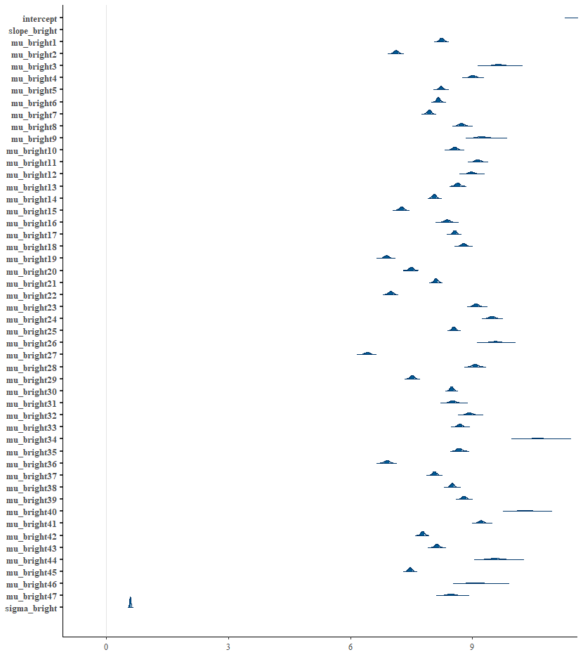


<br>
<br>

#### Predictive accuracy

<br> 
<br>

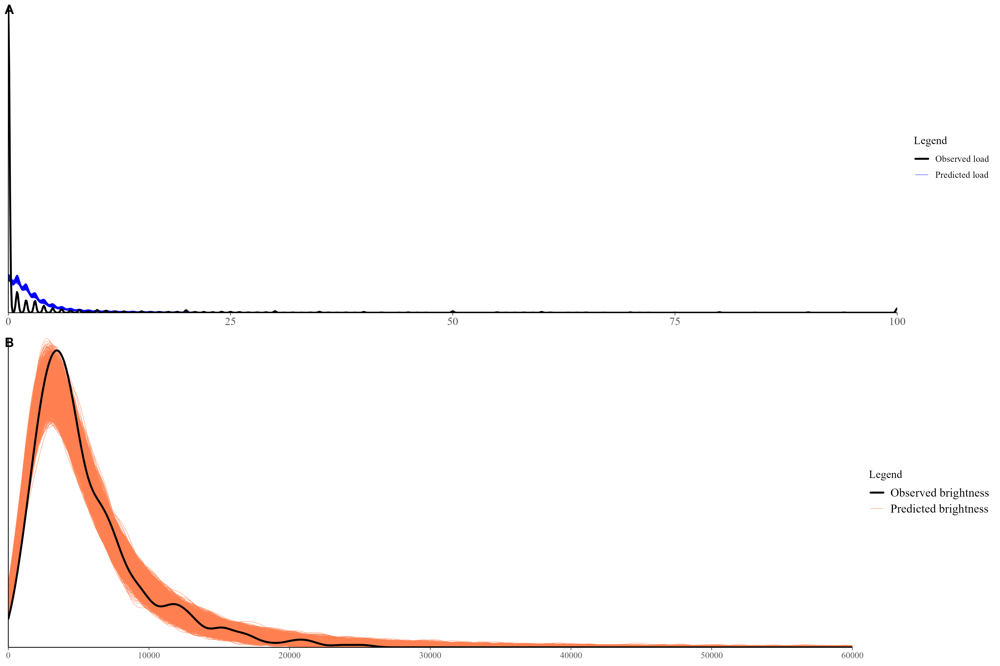


<br> 
<br>
<br>

## 1.2. Load ~ habitat

<br>
<br>

> 47 $i$ species with load data and 30 $h$ species with brightness data
> **We assume a negative slope, with arboreous snails showing less load (terrestrial coded as 0, arboreous as 1)**

<br>

#### Habitat Model
\[ 
\text{habitat}_h \sim \text{Bernoulli}(\text{habitat\_prob}_{\text{species}_h})
\]

#### Nematode Load Model
\[ 
\lambda_j = \text{intercept} + \text{slope\_habitat} \times \text{habitat\_prob}
\]
\[ 
\text{load}_i \sim \text{Poisson}(\exp(\lambda_{\text{species}_i}))
\]


### Stan

``` stan
data {
  int<lower=0> N_nem;               // Number of observations for nematode load
  int<lower=0> N_habitat;           // Number of observations for habitat
  array[N_nem] int<lower=0, upper=100> load;  // Nematode load counts
  array[N_habitat] int<lower=0, upper=1> habitat; // Habitat: 0 for terrestrial, 1 for arboreal
  int<lower=0> N_sp_nem;             // Number of species in the nematode data
  array[N_nem] int<lower=1, upper=N_sp_nem> species_i;   // New species id for load dataset
  array[N_habitat] int<lower=1, upper=N_sp_nem> species_h; // New species id for habitat dataset
}

parameters {
  real intercept;
  real<upper=0> slope_habitat;
  vector<lower=0, upper=1>[N_sp_nem] habitat_prob;  // Habitat probability for each species
}

model {
  vector[N_sp_nem] lambda;
  
  // Priors
  intercept ~ normal(0, 1);
  slope_habitat ~ normal(0, 1);
  habitat_prob ~ beta(2, 2);  // Prior for habitat probabilities
  
  // Model habitat
  habitat ~ bernoulli(habitat_prob[species_h]);
  
  // Model nematode load
  lambda = intercept + slope_habitat * habitat_prob;
  load ~ poisson_log(lambda[species_i]);
}

generated quantities {
  array[N_habitat] real predicted_habitat;  // Predicted habitat probabilities
  array[N_nem] int predicted_load;  // Predicted nematode load
  
  for (n in 1:N_nem) {
    predicted_load[n] = poisson_log_rng(intercept + slope_habitat * habitat_prob[species_i[n]]);
  }
  
  for (h in 1:N_habitat) {
    predicted_habitat[h] = bernoulli_rng(habitat_prob[species_h[h]]);
  }
}
```


#### Posteriors

<br>
<br>


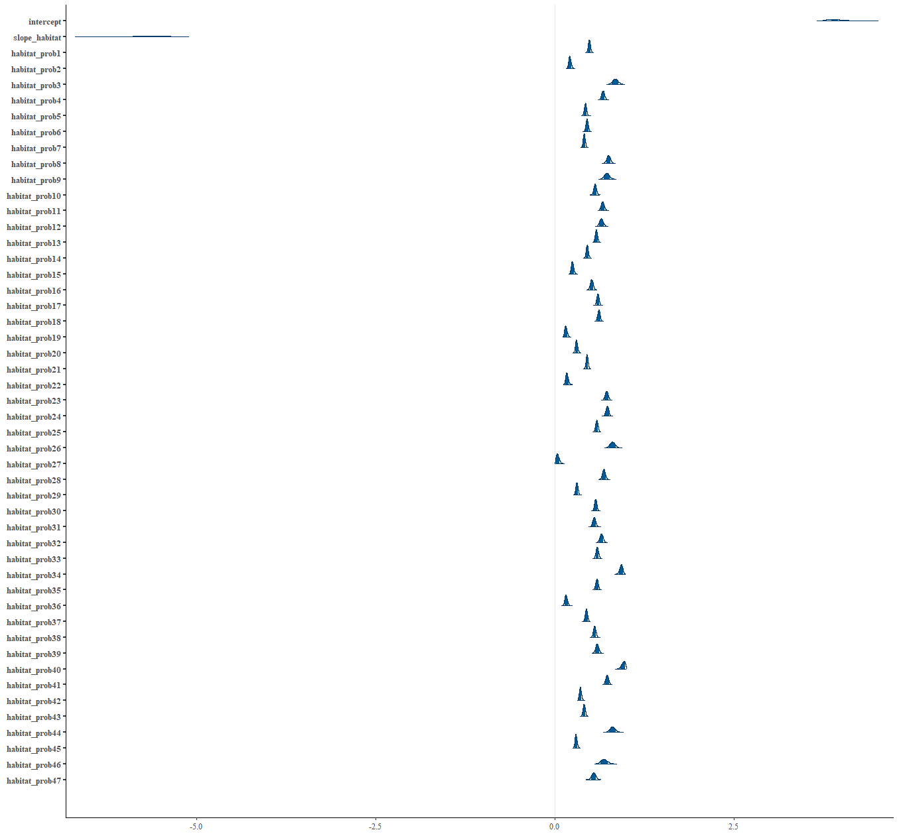


<br>
<br>


#### Predictive accuracy

<br> 
<br>

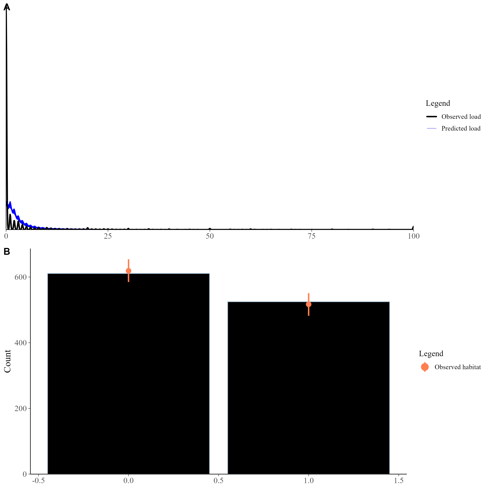


<br> 
<br>
<br>

## 1.3. Load ~ vegetation zone

<br>
<br>

> 47 $i$ species with load data and 26 $v$ species with brightness data
> **We assume a negative slope, with snails inhabiting arid zones showing less load (humid coded as 0, arid as 1)**

<br>

#### Vegetation Zone Model
\[ 
\text{vegetation}_v \sim \text{Bernoulli}(\text{vegetation\_prob}_{\text{species}_v})
\]

#### Nematode Load Model
\[ 
\lambda_j = \text{intercept} + \text{slope\_vegetation} \times \text{vegetation\_prob}
\]
\[ 
\text{load}_i \sim \text{Poisson}(\exp(\lambda_{\text{species}_i}))
\]


### Stan

``` stan
data {
  int<lower=0> N_nem;               // Number of observations for nematode load
  int<lower=0> N_veg;               // Number of observations for vegetation zone
  array[N_nem] int<lower=0, upper=100> load;  // Nematode load counts
  array[N_veg] int<lower=0, upper=1> vegetation; // Vegetation zone: 0 for humid, 1 for arid
  int<lower=0> N_sp_nem;             // Number of species in the nematode data
  array[N_nem] int<lower=1, upper=N_sp_nem> species_i;   // New species id for load dataset
  array[N_veg] int<lower=1, upper=N_sp_nem> species_v; // New species id for vegetation dataset
}

parameters {
  real intercept;
  real<upper=0> slope_vegetation;
  vector<lower=0, upper=1>[N_sp_nem] vegetation_prob;  // Vegetation probability for each species
}

model {
  vector[N_sp_nem] lambda;
  
  // Priors
  intercept ~ normal(0, 1);
  slope_vegetation ~ normal(0, 1);
  vegetation_prob ~ beta(2, 2);  // Prior for vegetation probabilities
  
  // Model vegetation zone
  vegetation ~ bernoulli(vegetation_prob[species_v]);
  
  // Model nematode load
  lambda = intercept + slope_vegetation * vegetation_prob;
  load ~ poisson_log(lambda[species_i]);
}

generated quantities {
  array[N_veg] real predicted_vegetation;  // Predicted vegetation probabilities
  array[N_nem] int predicted_load;  // Predicted nematode load
  
  for (n in 1:N_nem) {
    predicted_load[n] = poisson_log_rng(intercept + slope_vegetation * vegetation_prob[species_i[n]]);
  }
  
  for (v in 1:N_veg) {
    predicted_vegetation[v] = bernoulli_rng(vegetation_prob[species_v[v]]);
  }
}

```


#### Posteriors

<br>
<br>


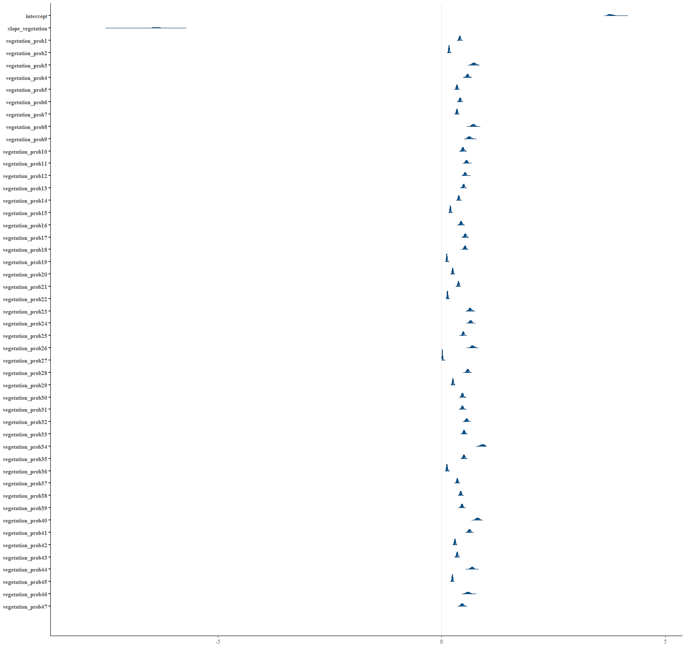
<br>
<br>


#### Predictive accuracy

<br> 
<br>

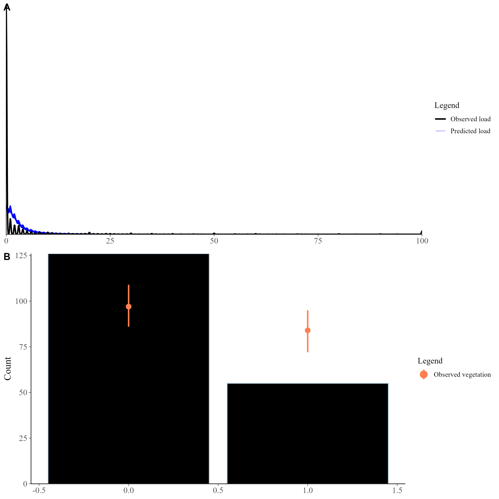


<br> 
<br>
<br>


## 1.3. Load ~ island age and area

#### Nematode Load Model

\[ 
\lambda_i = \text{intercept} + \text{slope\_age} \times \text{island\_age}_i + \text{slope\_area} \times \log(\text{island\_area}_i)
\]
\[ 
\text{load}_i \sim \text{Poisson}(\exp(\lambda_i))
\]

### Stan

``` stan
data {
  int<lower=0> N_nem;                      // Number of observations
  array[N_nem] int<lower=0, upper=100> load;  // Nematode load counts
  vector[N_nem] island_age;               // Island age for each observation
  vector[N_nem] island_area;            // Island area for each observation
}

transformed data {
  vector[N_nem] log_island_area;
  log_island_area = log(island_area);  // Log-transform island area
}

parameters {
  real intercept;
  real slope_age;                      // Slope for island age
  real slope_area;                     // Slope for log-transformed island area
}

model {
  vector[N_nem] lambda;
  
  // Priors
  intercept ~ normal(0, 1);
  slope_age ~ normal(0, 1);
  slope_area ~ normal(0, 1);
  
  // Linear predictor
  lambda = intercept + slope_age * island_age + slope_area * log_island_area;
  
  // Model
  load ~ poisson_log(lambda); 
}

generated quantities {
  array[N_nem] int predicted_load;  // Predicted nematode load
  
  for (n in 1:N_nem) {
    predicted_load[n] = poisson_log_rng(intercept + slope_age * island_age[n] + slope_area * log_island_area[n]);
  }
}

```


#### Posteriors

<br>
<br>


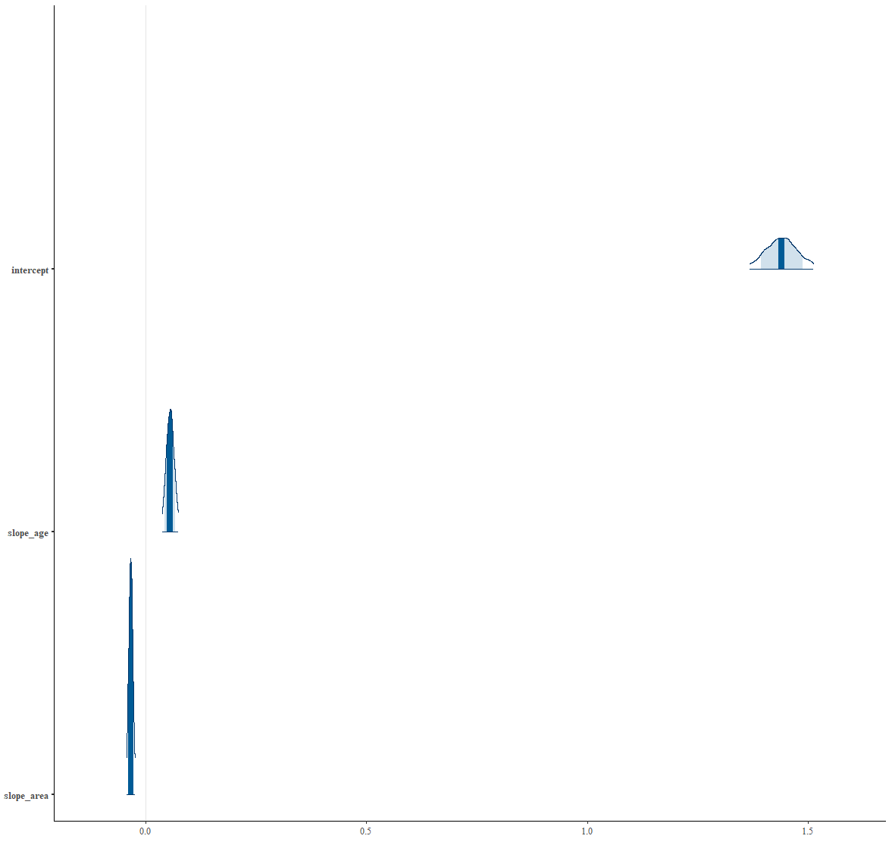
<br>
<br>

#### Predictive accuracy

<br> 
<br>

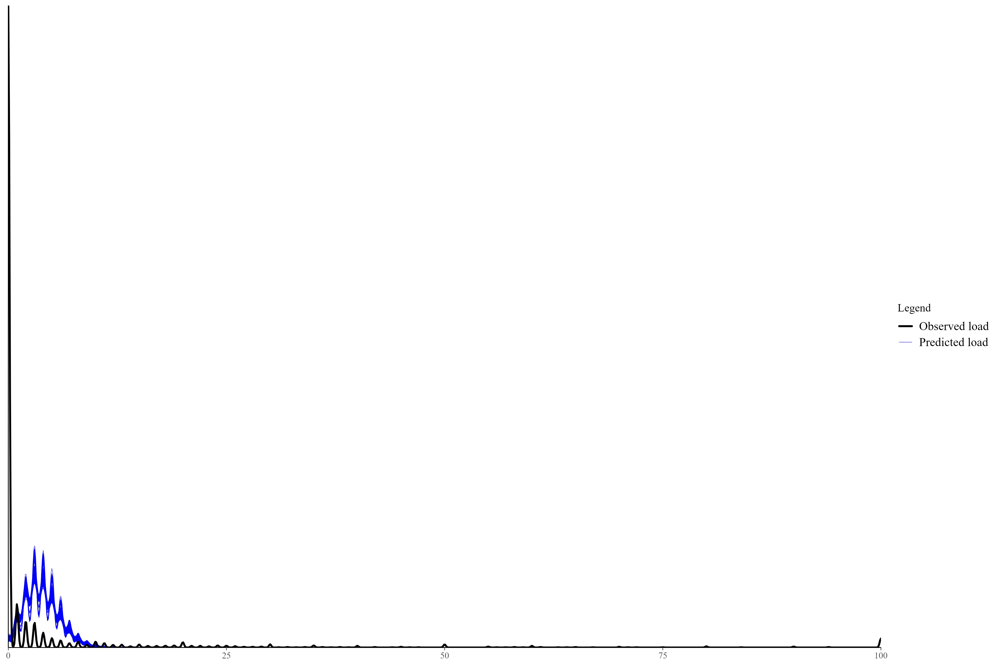


<br> 
<br>
<br>


# 2. Phylogenetic signal of encapsulations in the Naesiotus radiation

<br>
<br>


Departuring from the most recent tree built using RAD seq, we use the RAD database to add the tip names:

<br>

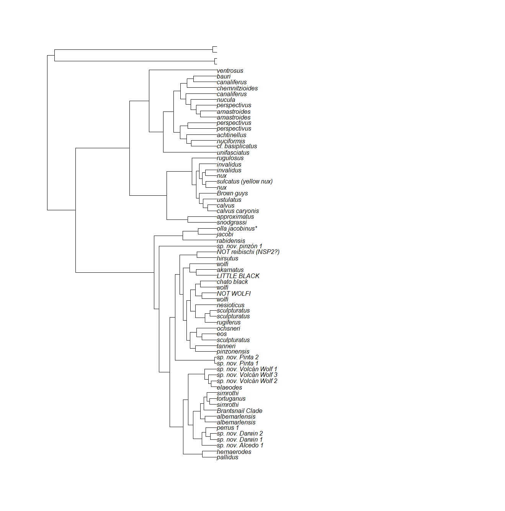

<br>
<br>


We prune it to keep only the species we analyzed that match the current names:

<br>

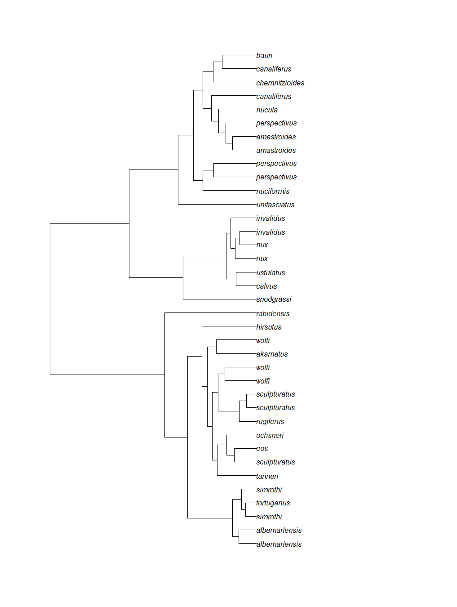

<br>
<br>

> We use the **phytools** package to test for phylogenetic signal.

## Klomberg's K

<br>

Phylogenetic signal K : **2.21319** 
MLE(sig2) : 6.27678e-05 
logL(sig2) : -36.6456 
P-value (based on 1000 randomizations) : **0.001** 

<br>


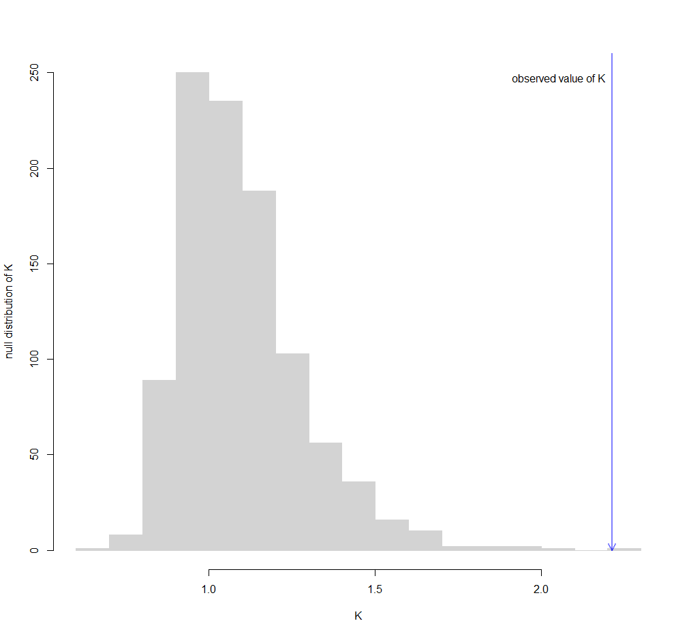

<br>


Plotting the trait value and branches using **contMap()** function:

<br>


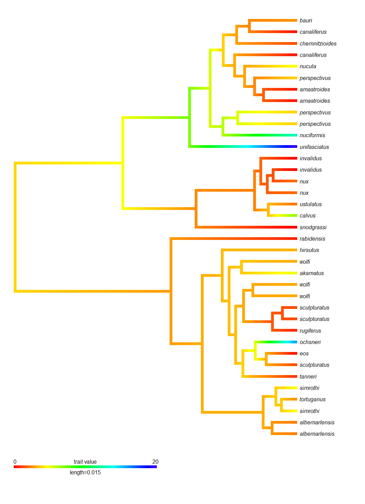
